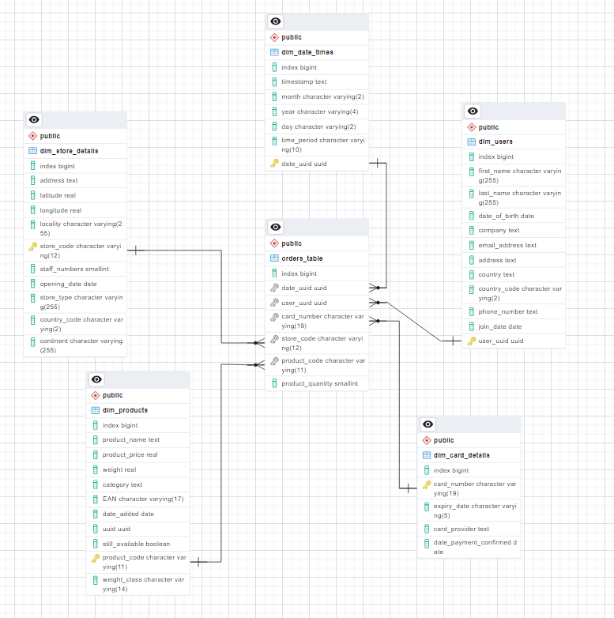
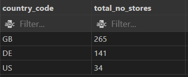
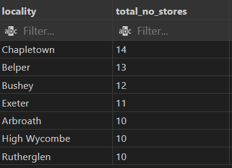
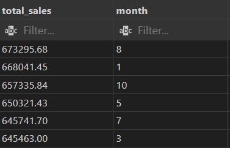
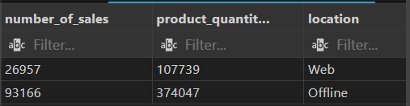
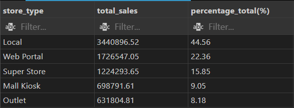
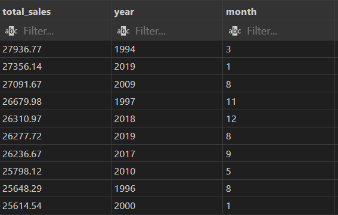
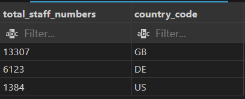
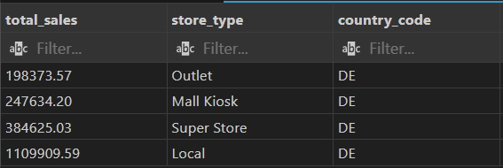
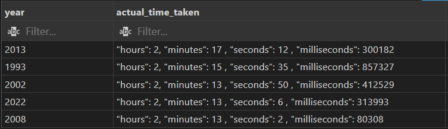

# multinational-retail-data-centralisation387

## Table of Contents
 - [Description](#Description)
 - [Install Instructions](#Install-Instructions)
 - [Usage Instructions](#Usage-Instructions)
 - [File Structure](#File-Structure)
 - [License](#License)

## Description
A multinational company sells various goods across the globe.

Currently, their sales data is spread across many different data sources making it not easily accessible or analysable by current members of the team.

In an effort to become more data-driven, the organisation would like to make its sales data accessible from one centralised location.

The first goal will be to produce a system that stores the current company data in a database so that it's accessed from one centralised location and acts as a single source of truth for sales data.

The database will then be queried to get up-to-date metrics for the business.

## Install Instructions
Clone the repo using: ``` git clone https://github.com/RegnixS/multinational-retail-data-centralisation ``` \
Put all the files in a folder anywhere you like in your file system. \
The environment variable for the API key should be set in the .env file. \
See the .env.example file for the format. \
From the installation folder you can run: ``` python data_cleaning.py ``` 

## Usage instructions
### Python files
The purpose of the project is to extract data from various sources, clean and upload the results in a new database. \
To do this, run: ``` python data_cleaning.py ``` 

The other 2 python files can be called for utility purposes as follows: \
database_utils.py: runnning this will give a list of files at the RDS database detailed in db_creds.yaml. \
data_extraction.py: running this will extract all the data from the various sources and upload the results without cleaning. The table names will have prefix: "legacy_". 

Running data_cleaning.py and data_extraction.py require the local database to be defined in a YAML file.
The layout is as follows:
RDS_HOST: localhost \
RDS_PASSWORD: ********** \
RDS_USER: <user_name> \
RDS_DATABASE: sales_data \
RDS_PORT: 5432 \
*Note: "RDS" is used even though the database is local because the same class is used to access the RDS database.*

The access key for the API is defined in an environment varible in .env \
The example defintition is in file: .env.example

### SQL files
For the latter parts of the project a few SQL related files are included as follows:

An ERD diagram of the database can be viewed in sales_data_erd.pgerd. 


The queries from Milestone 4 can be run from milestone_4_queries.sql with a connection to the sales_data database. 

The results from the queries are:
```
/* Task 1 Which countries we currently operate in and which country now has the most stores */
SELECT country_code, 
		COUNT(country_code) AS total_no_stores
	FROM dim_store_details
	WHERE locality <> 'N/A'
	GROUP BY country_code
	ORDER BY COUNT(country_code) DESC
	;
```

```
/* Task 2 Which locations have the most stores currently */
SELECT locality, 
		COUNT(locality) AS total_no_stores
	FROM dim_store_details
	GROUP BY locality
	HAVING COUNT(locality) >= 10
	ORDER BY COUNT(locality) DESC
	;
```

```
/* Task 3 Which months have produced the most sales */
SELECT ROUND(SUM(product_quantity * product_price):: NUMERIC, 2) AS total_sales,
		month
	FROM orders_table o
	JOIN dim_date_times dt ON o.date_uuid = dt.date_uuid
	JOIN dim_products p ON o.product_code = p.product_code
	GROUP BY month
	ORDER BY total_sales DESC
	LIMIT 6
	;
```

```
/* Task 4 How many products were sold and the amount of sales made for online and offline purchases */
SELECT count(product_code) AS number_of_sales,
		SUM(product_quantity) AS product_quantity_count,
		(CASE WHEN store_type = 'Web Portal' THEN 'Web' ELSE 'Offline' END) AS location 
	FROM orders_table o
	JOIN dim_store_details s ON o.store_code = s.store_code
	GROUP BY location
	ORDER BY location DESC
	;
```

```
/* Task 5 which of the different store types has generated the most revenue */
SELECT store_type, 
		ROUND(SUM(product_quantity * product_price):: NUMERIC, 2) AS total_sales,
		ROUND(SUM(product_quantity * product_price):: NUMERIC / SUM(SUM(product_quantity * product_price):: NUMERIC) OVER () * 100 , 2) AS "percentage_total(%)"
	FROM orders_table o
	JOIN dim_store_details s ON o.store_code = s.store_code
	JOIN dim_products p ON o.product_code = p.product_code
	GROUP BY store_type
	ORDER BY total_sales DESC
	;
```

```
/* Task 6 Which months in which years have had the most sales historically */
SELECT ROUND(SUM(product_quantity * product_price):: NUMERIC, 2) AS total_sales,
		year,
		month
	FROM orders_table o
	JOIN dim_date_times dt ON o.date_uuid = dt.date_uuid
	JOIN dim_products p ON o.product_code = p.product_code
	GROUP BY year, month
	ORDER BY total_sales DESC
	LIMIT 10
	;
```

```
/* Task 7 Staff numbers in each of the countries the company sells in */
SELECT SUM(staff_numbers) AS total_staff_numbers,
		country_code
	FROM dim_store_details
	GROUP BY country_code
	ORDER BY total_staff_numbers DESC
	;
```

```
/* Task 8 Which type of store is generating the most sales in Germany */
SELECT ROUND(SUM(product_quantity * product_price):: NUMERIC, 2) AS total_sales,
		store_type,
		MAX(country_code) AS country_code
	FROM orders_table o
	JOIN dim_store_details s ON o.store_code = s.store_code
	JOIN dim_products p ON o.product_code = p.product_code
	WHERE country_code = 'DE'
	GROUP BY store_type
	ORDER BY total_sales
	;
```

```
/* Task 9 Average time taken between each sale grouped by year */
WITH cte1 AS (
	SELECT year,
			(year || '-' || month || '-' || day || ' ' || timestamp):: TIMESTAMP AS date_time
		FROM dim_date_times
		ORDER BY date_time DESC
	), cte2 AS ( 
	SELECT year,
			date_time - LEAD(date_time) OVER() AS diff
		FROM cte1
	)
SELECT year,
		('"hours": ' || SPLIT_PART(AVG(diff):: VARCHAR, ':', 1):: NUMERIC ||
		', "minutes": ' || SPLIT_PART(AVG(diff):: VARCHAR, ':', 2):: NUMERIC ||
		' , "seconds": ' || SUBSTRING(AVG(diff):: VARCHAR, 7, 2):: NUMERIC ||
		' , "milliseconds": ' || SPLIT_PART(AVG(diff):: VARCHAR, '.', 2):: NUMERIC) AS actual_time_taken
	FROM cte2
	GROUP BY year
	ORDER BY AVG(diff) DESC
	LIMIT 5
	;
```


## File structure of the project:
data_cleaning.py: Implements a class for cleaning legacy data. \
database_utils.py: Implements a class for interacting with databases. \
data_extraction.py: Implements a class for extracting data. \
sales_data_erd.pgerd: sales_data database diagram \
milestone_4_queries.sql SQL Queries for Milestone 4\
.env.example: example api key definition

## License information:
MIT License

Copyright (c) 2023 Robert Ducke

Permission is hereby granted, free of charge, to any person obtaining a copy
of this software and associated documentation files (the "Software"), to deal
in the Software without restriction, including without limitation the rights
to use, copy, modify, merge, publish, distribute, sublicense, and/or sell
copies of the Software, and to permit persons to whom the Software is
furnished to do so, subject to the following conditions:

The above copyright notice and this permission notice shall be included in all
copies or substantial portions of the Software.

THE SOFTWARE IS PROVIDED "AS IS", WITHOUT WARRANTY OF ANY KIND, EXPRESS OR
IMPLIED, INCLUDING BUT NOT LIMITED TO THE WARRANTIES OF MERCHANTABILITY,
FITNESS FOR A PARTICULAR PURPOSE AND NONINFRINGEMENT. IN NO EVENT SHALL THE
AUTHORS OR COPYRIGHT HOLDERS BE LIABLE FOR ANY CLAIM, DAMAGES OR OTHER
LIABILITY, WHETHER IN AN ACTION OF CONTRACT, TORT OR OTHERWISE, ARISING FROM,
OUT OF OR IN CONNECTION WITH THE SOFTWARE OR THE USE OR OTHER DEALINGS IN THE
SOFTWARE.
